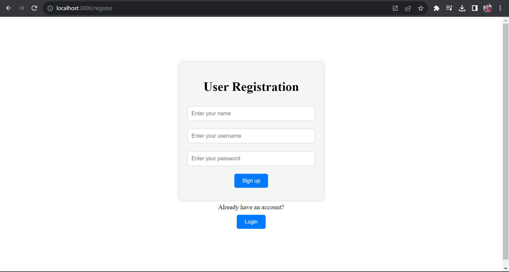
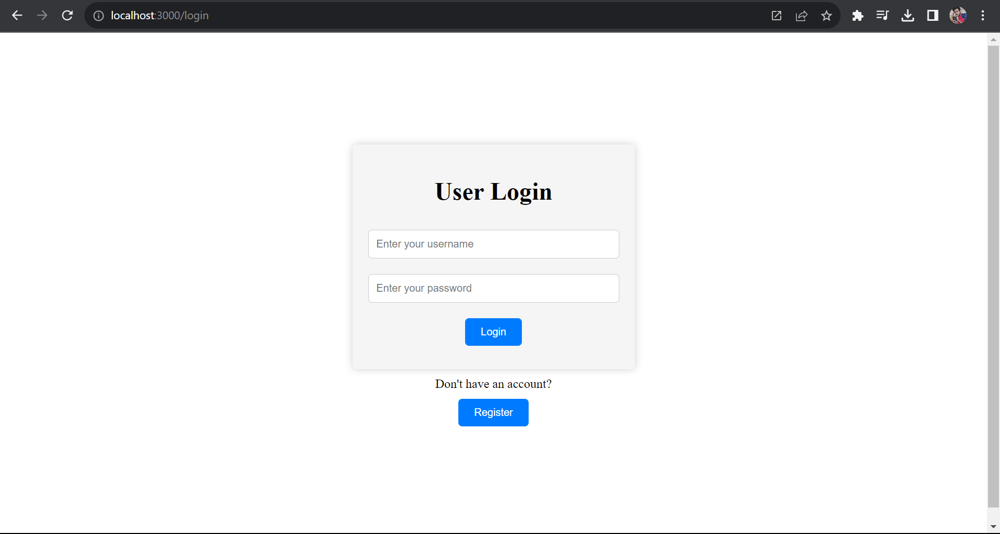
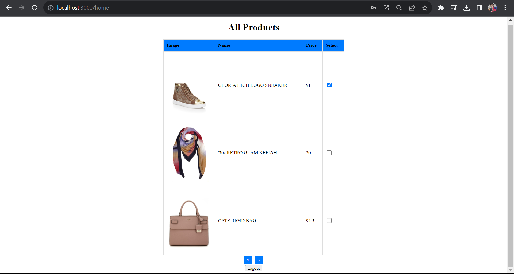
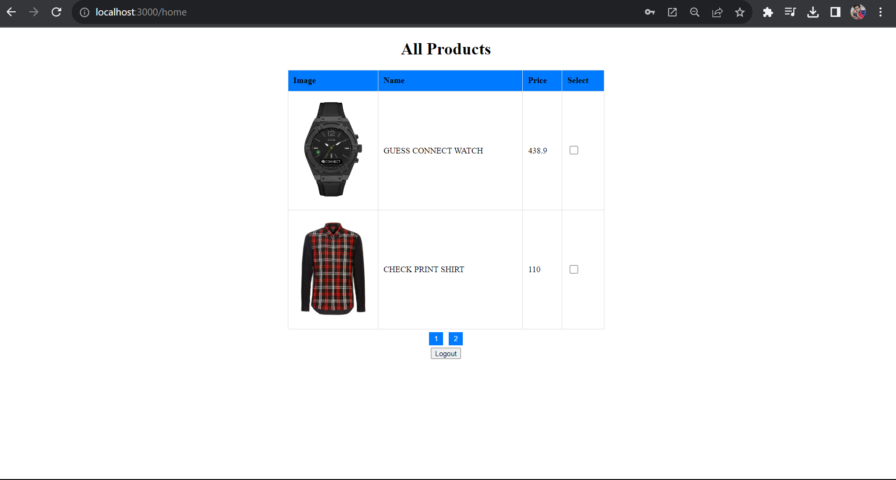

# MERN - User Authentication and Product Display App

This web application allows users to register, log in, and view a list of products. Users can also mark products as favorites, and their selections will be remembered when they log in again.

## Frontend

The frontend of this application is built using React.js and includes the following pages:

### User Registration

- Users can register by providing their name, username, and password.
- Upon successful registration, they are redirected to the login page.

### User Login

- Registered users can log in using their username and password.
- After successful login, users are redirected to the homepage.

### Home Page

- Authenticated users can view a list of products.
- Products are displayed in a paginated table format with a fixed number of products per page.

- Users can mark products as favorites by checking checkboxes next to each product.
- Products marked as favorites are remembered for the user.
- Users can log out by clicking the "Logout" button.

## Backend

The backend of this application is built using Node.js and Express.js, and it includes the following API endpoints:

### User Registration (POST /api/register)

- Allows users to register with a unique username.
- Stores user information securely in the database.

### User Login (POST /api/login)

- Validates user credentials (username and password).
- Issues a JSON Web Token (JWT) upon successful login.
- JWT is used for authentication on protected routes.

### Protected Home Page (GET /api/home)

- Requires a valid JWT token for authentication.
- Serves a list of products from the database.
- Allows users to mark products as favorites, and these selections are stored for each user.
- Supports pagination for displaying products.

## Technologies Used

- Frontend: React.js, Axios
- Backend: Node.js, Express.js, MongoDB (for user and product data)
- Authentication: JSON Web Tokens (JWT)
- Styling: CSS

## Getting Started

1. Clone this repository to your local machine.

2. Install dependencies:
   cd client
   npm install
   cd ../server
   npm install

3. Set up your MongoDB database and update the connection string in `server.js`.

4. Start the frontend and backend servers:
   cd client
   npm start
   cd ../server
   npm start

5. Access the application at `http://localhost:3000` in your web browser.

## Future Enhancements

- User profile page to display user details and favorite products.
- Improved error handling and user feedback.
- User password hashing for enhanced security.

Feel free to contribute or suggest improvements to this project!

Veeral Kansara.
